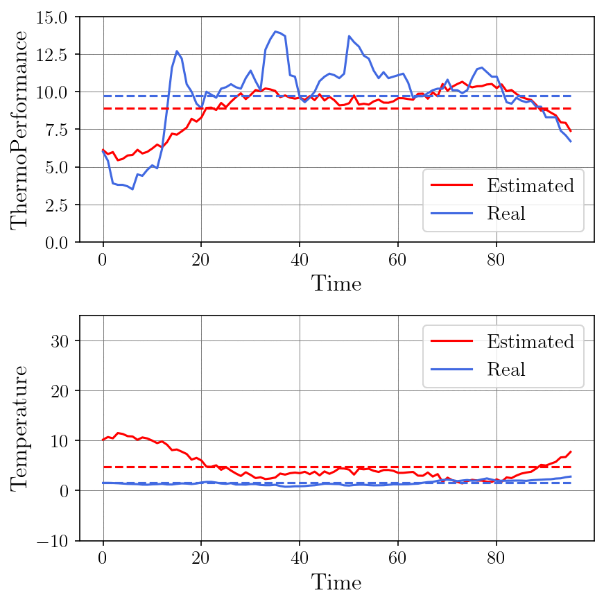

# Hybrid Transformer-GRU Time Series Forecasting

A powerful hybrid model combining the long-range capabilities of Transformers with the sequential strengths of GRUs (Gated Recurrent Units) for accurate and robust time series forecasting.


<p align="center">
  
</p>


## 📌 Features

* ⚡ Combines Transformer attention with GRU recurrence
* 🧠 Captures both long-term dependencies and short-term patterns
* 📈 Supports multi-step forecasting
* 🧪 Easy to train and extend with your own datasets


## 🏗️ Architecture

The model consists of:

* A **Transformer Encoder** for modeling global attention across the sequence
* A **GRU Decoder** to refine predictions in temporal order


## 🚀 Quick Start

```bash
git clone https://github.com/yourusername/hybrid-transformer-gru.git
cd hybrid-transformer-gru
```

## 📦 Prerequisites

Before you begin, ensure your environment meets the following requirements:

* **Python** ≥ 3.6
* **PyTorch** ≥ 1.0 (CUDA support recommended for faster training)

We also recommend using a virtual environment (e.g., `venv` or `conda`) to avoid package conflicts.


## 🧪 Example Forecast

Below is a GIF showing predicted vs. actual values on a sample dataset:


## 🧾 Configuration

Modify `config/config.yaml` to set:

* Sequence length
* Number of layers/heads
* GRU hidden size
* Learning rate, optimizer, etc.


## 📌 Citation
If you use this code or build upon our work, please cite our paper:


```bibtex
@inproceedings{altinses2023XX,
  title={XXXX},
  author={Altinses, Diyar and Schwung, Andreas},
  booktitle={XXXXX},
  pages={XXX},
  year={XXXX},
  organization={XXX}
}
```


## 📚 Related Projects 

Below are selected related works and projects that inspired or complement this research:

<a id="1">[1]</a> Altinses, D., & Schwung, A. (2023, October). Multimodal Synthetic Dataset Balancing: A Framework for Realistic and Balanced Training Data Generation in Industrial Settings. In IECON 2023-49th Annual Conference of the IEEE Industrial Electronics Society (pp. 1-7). IEEE.

<a id="2">[2]</a> Altinses, D., & Schwung, A. (2025). Performance benchmarking of multimodal data-driven approaches in industrial settings. Machine Learning with Applications, 100691.

<a id="3">[3]</a> Altinses, D., & Schwung, A. (2023, October). Deep Multimodal Fusion with Corrupted Spatio-Temporal Data Using Fuzzy Regularization. In IECON 2023-49th Annual Conference of the IEEE Industrial Electronics Society (pp. 1-7). IEEE.

<a id="4">[4]</a> Altinses, D., Torres, D. O. S., Lier, S., & Schwung, A. (2025, February). Neural Data Fusion Enhanced PD Control for Precision Drone Landing in Synthetic Environments. In 2025 IEEE International Conference on Mechatronics (ICM) (pp. 1-7). IEEE.

<a id="5">[5]</a> Torres, D. O. S., Altinses, D., & Schwung, A. (2025, March). Data Imputation Techniques Using the Bag of Functions: Addressing Variable Input Lengths and Missing Data in Time Series Decomposition. In 2025 IEEE International Conference on Industrial Technology (ICIT) (pp. 1-7). IEEE.


